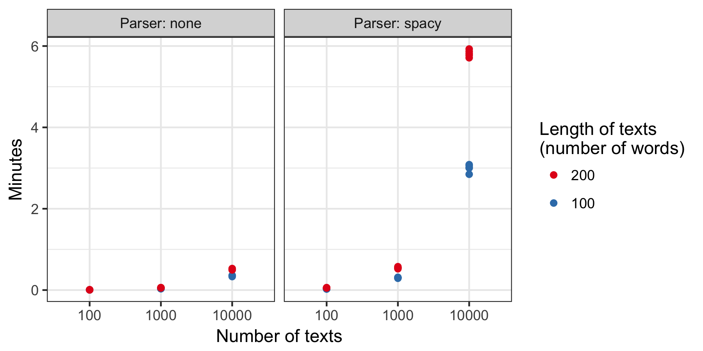

```{r setup, echo=FALSE}
knitr::opts_chunk$set(comment = NA, echo=FALSE, message = FALSE, warning = FALSE)
```

## Introduction 

Politeness is a universal dimension of human communication (Lakoff, 1973; Brown & Levinson, 1987). In practically all settings, a speaker can choose to be more or less polite to their audience. In this package, we provide tools to measure the markers and effects of politeness in natural language.

```{r, echo=TRUE}
library(politeness)
```

## Citation

If you find this package useful, please cite us, using the following reference from our R Journal publication.

Yeomans, M., Kantor, A. & Tingley, D. (2018). Detecting Politeness in Natural Language. The R Journal, 10(2), 489-502.

Note that this publication was written using version 0.2.4 of the package. We consider this vignette as a more up-to-date description of the functionality in the package.


## Motivation for package

Politeness as a construct is universal. And research in many branches of social science might reasonable want to measure a construct like politeness in langauge and then compare it to some covariate of interest. For example, they might want to know whether some treatment caused people to speak more or less politely. Or they want to know whether speakers are more polite to some listeners than to others, perhaps based on the listeners' gender, or race, or status. 

In these cases it would be helpful to have a model that could condense text into a single "politeness score" that could, say, be entered into a regression. However, the causes and consequences of politeness are often situationally specific. Furthermore, the particular set of linguistic markers that define politeness can also vary from context to context. Thus, it would be difficult (or misleading) to estimate a single model as some universal "politeness classifier" for all situations. 

Instead, we offer tools for a workflow that we believe will be useful to most researchers interested in linguistic politeness. First, we offer a tool, `politeness` that will calculate a set of linguistic features that have been identified in the past as relating to politeness. Second, we offer a tool, `featurePlot` to visualize these counts, in comparison to a binary covariate of interest (e.g. high/low status). Third, we offer a tool, `findExamples` for exploring texts at the extremes of a dimension - either a continuous covariate, or else the output of a classifier model.

If the researcher wants to generate a politeness classifier, they can do so using the `trainModel` function, which creates a single mapping from the politeness features in the supplied text to the covariate of interest. This can then be used to predict the covariate itself in held-out texts. In particular, if the researcher has some "ground truth" hand-generated labels of politeness over a set of texts, they can use this function as a politeness classifier, and automatically assign politeness scores to many more new texts. 

## Politeness Features

The main value of this package is in the `politeness` function, which counts the use of different politeness features in natural language. Here, we initially borrowed directly from existing research on the computational linguistics of politeness (Brown & Levinson, 1987; Danescu-Niculescu-Mizil et al., 2013; Voigt et al., 2017). However, features have also been added and revised based on ongoing research (e.g. Acknowledgement, Subjectivity, Disagreement). These features are summarized in the table below, along with examples of each.

```{r}
data("feature_table")

knitr::kable(feature_table,align=rep("c",4),
             col.names = c("Feature Name",
                           "POS Tags",
                           "Description",
                           "Example"),
             caption = "Table 1: Politeness Features")
```

## Dependency Parsing

Many of the politeness features contained in this package use dependency parsing. We have prioritized compatibility with the popular python NLP library [SpaCy](https://spacy.io/) This library is simple to install in python, although the procedure can vary for different machines. Our software also depends on a convenient wrapper function, [spacyr](https://spacyr.quanteda.io/), that includes several installation tools.

Please confirm that your machine can run SpaCy and spacyr first! This step can be difficult for some machines, and we defer to the existing documentation for that software as a guide.

If SpaCy installation is proving difficult, we have created a notebook in  [Google Colab](https://colab.research.google.com/drive/1EmVhqlPLUIlFjYw73nzydtfT1PQ8QU2_?usp=sharing) that can run the package on the cloud without any difficult installation issues. This is recommended for first-time users who are not familiar with the underlying tools and would like to try out the package with minimal hassle. 


When R (or Rstudio) is opened at first, the SpaCy engine must be initialized, so that it is ready for use during the session. SpaCyR has recently included tools to initialize automatically from R the first time it is called in a session - however, you may have to initialize it manually, using the location of their python initialization (e.g. "/anaconda/bin/python"):

```{r, eval=FALSE, echo=TRUE}
# install.packages("spacyr")
spacyr::spacy_initialize(python_executable = "PYTHON_PATH")

```

Many of the politeness features can be run without using dependency parsing by setting `parser="none"`. We recommend this as an initial first step for researchers who may be new to python. However, the performance of the package is significantly lower without  If the software cannot identify the grammar in the text, some features will be dropped entirely (e.g. Bare Commands are a specific verb class), and others will be approximated (e.g. question types will not be distinguished, emotion categories will not account for negators). We highly recommend conducting final analyses with grammar parsing.

## Data: phone_offers

```{r}
data("phone_offers")
```

We have included an example dataset, `phone_offers`, for researchers to get a handle on the workflow. These data were collected from Mechanical Turk workers, who were given a Craigslist advertisement for a used iPhone and were told to write a message to the seller offering to buy it at a specific price that was less than what was posted. In essence, they were opening a negotiation over the sale price of the phone. Naturally, this is a domain where politeness might have effects on important outcomes. 

Half the participants were told to use a "warm and friendly" communication style, while the other half were told to use a "tough and firm" communication style. In this research, the politeness detector was used to define the construct - that is, what were the linguistic differences between messages from these two conditions? This software served two goals for that research. First, it provided a simple description of the differences to understand the data better (i.e. "what are the features that differ?"). Second, it allowed for basic estimation of a politeness detector, that could be applied in-context to quantify politeness in other negotiations.

## Detecting politeness features

The function `politeness()` takes in an *n*-length vector of texts, and returns an *n*-by-*f* data.frame, with *f* columns corresponding to the number of calculated features. Some user options affect the number of features that are returned. For one, if a dependency parser is not used (by setting `parser = "none"`) then some features that depend on these tags will not be calculated. Additionally, you may use the setting `drop_blank = TRUE` which will remove features that were not detected in any of the texts.

The cells are calculated in one of three ways. Setting `metric = "count"` will populate each cell with the raw count of each feature in the text. Alternatively, `metric = "binary" ` will return a binary indicator of the presence or absence of features. For many features these are essentially equivalent, since they are typically present only once, or not at all (e.g. "hello", "goodbye"). However, other features can be used many times in a single communication (e.g. positive words). An additional concern researchers may have is if their documents have a lot of variance on length - in that case, controlling for length with `metric = "average"` will generate the presence of each feature as a percentage of the total words in each document. We do not recommend this option as a default because length is often intrinsically correlated with politeness (e.g. "being short" with someone is synonymous with rudeness) so this may ony be desirable when the variance in length is large, and confounded by other factors besides politeness (e.g. a dataset with news )

```{r, echo=TRUE, eval=TRUE}
df_politeness_count <- politeness(phone_offers$message, metric="count")
df_politeness_count[20:30,1:5]
```

```{r, echo=TRUE, eval=TRUE}
df_politeness <- politeness(phone_offers$message, metric="binary")
df_politeness[20:30,1:5]
```

## Plotting politeness features

The best way to inspect the results of the main `politeness` function is to plot the counts using `featurePlot()`. This function produces a `ggplot2` object that compares how the counts of every politeness feature differ across a binary covariate of interest (e.g. how often each feature is used in the treatment condition versus the control). The covariate vector must itself be binary `(0/1)` but users can adjust the labels on the graph as necessary. 

The order of the features is determined by calculating the variance-weighted log odds of each feature with resepct to the binary covariate. The plot sorts features automatically so that the most distinctive are towards the top and bottom of the plot. The function can handle data of any metric - binary, count or average - but that distinction must be made in the initial call to `politeness()`. 

Often some features are not meaningful for further analysis - either because they are too rare in the data, or else because they do not meaningfully covary with the covariate of interest. Users have two options to exclude these from the plot. First, the `drop_blank` parameter can remove rare features - it takes a number between 0 and 1, which determines a cut-off based on prevalence. Specifically, all features which appear in less than this proportion of texts are excluded from the plot. To include all features, leave this value at `0`. Second, the `middle_out` parameter can remove features which do not vary meaningfully across the covariate - it takes a number between 0 and 1, which determines a cut-off based on distinctiveness. Each feature is evaluated using a t.test, and features are removed when the p-value of this test lies above the user's cut-off. To include all features, simply set this value at `1`. We do not recommend this as a formal hypothesis test (there is no adjustment for multiple comparisons, for starters). Rather, this is useful as a dsecriptive sense for identifying the most distinctive features.

```{r, echo=TRUE, eval=FALSE}
politeness::featurePlot(df_politeness,
                        split=phone_offers$condition,
                        split_levels = c("Tough","Warm"),
                        split_name = "Condition")
```

```{r, fig.width=6, fig.height=8, eval=TRUE}
politeness::featurePlot(df_politeness,
                        split=phone_offers$condition,
                        split_levels = c("Tough","Warm"),
                        split_name = "Condition")
```

## Projecting politeness features

`trainModel()` 

Users can generate a politeness classifier with the `trainModel` function. This creates a single mapping from the politeness features in the supplied text to the covariate of interest. This can then be used to predict the covariate itself in held-out texts. In particular, if the user has some "ground truth" hand-generated labels of politeness over a set of texts, they can use this function as a politeness classifier, and automatically assign politeness scores to many more new texts. 

This function is a wrapper around supervised learning algorithms. The default uses \code{glmnet}, the vanilla LASSO implementation in R. This should be familiar to most users already. We also allow users to use a different algorithm, \code{texitr}, which implements a massively multinomial inverse regression. Intuitively, this model represents a more realistic causal structure to text-plus-covariate data - that is, the covariate typically has a causal effect on the words used by the speaker, rather than the other way around. 

Both packages have their merits, though for now we recommend using \code{glmnet} to start, especially if it is familiar. Both algorithms are computationally efficient, and can be improved by registering a parallel back-end (see package details) and passing the necessary argument on to the classifier function.

In addition to the `phone_offers` dataset, we have also included a smaller `bowl_offers` dataset. Participants in this study were given similar instructions (i.e. communicate in a warm or tough style) but for a different negotiation exercise. We use the `phone_offers` dataset to define the construct of interest, and confirm that the treatment had similar effects in `bowl_offers` by using it as held-out data in `trainModel()`. The results confirm that the manipulation had similar consequences on the participants' politeness.

```{r, echo=TRUE, eval=TRUE}

df_polite_train <- politeness(phone_offers$message)

df_polite_holdout<-politeness(bowl_offers$message)

project<-trainModel(df_polite_train,
                              phone_offers$condition,
                              df_polite_holdout)

mean(project$test_proj[bowl_offers$condition==1])

mean(project$test_proj[bowl_offers$condition==0])


```

## Reading texts that are high or low in politeness

`exampleTexts()`

The projected quantities from the `trainModel` function can be used in other analyses, but users should first be curious about examples of texts that best represent the extremes of that projection (i.e. the most or least polite texts). The `exampleTexts` function returns a selection of the texts that are the most extreme (i.e. high, or low, or both) along a covariate - this could be either the one used to train the model, or the output of the model itself. The parameters `type` and `num_docs` allow users to specify the type and number of texts that are returned.

```{r, echo=TRUE, eval=TRUE}
fpt_most<-exampleTexts(phone_offers$message,
                       phone_offers$condition,
                       type="most")
fpt_least<-exampleTexts(phone_offers$message,
                        phone_offers$condition,
                        type="least")
```

```{r, echo=FALSE, eval=TRUE}
print("Most Polite")
print(fpt_most)
print("Least Polite")
print(fpt_least)
```

## Execution time 

In principle, these functions can handle an arbitrarily large set of documents. In practice, however, language data can be quite large, both in the amount of documents and the length of the documents. This can have a marked effect on execution time, especially on smaller computers. 

To provide rough benchmarks, we ran the `politeness` function with a range of document counts (10^3, 10^4,10^5) and lengths (100,200). The tests were performed using a 2016 Macbook Pro with a 2.7 GHz Intel Core i7. For each case we ran it five times, both with and without dependency parsing, and the resulting execution times are plotted below. 

```{r,  out.width = "650px"}

```

This figure shows that `politeness` scales reasonably well for large sets of documents. For example, given 200-word documents, and using the `spacy` parser, we found that 1,000 and 10,000 length vectors of texts take an average of 0.54 and 5.8 minutes, respectively. 

## Conclusion

That's it! Enjoy! And please reach out to us with any questions, concerns, bug reports, use cases, comments, or fun facts you might have.

## References

Brown, P., & Levinson, S. C. (1987). Politeness: Some universals in language usage (Vol. 4). Cambridge university press.

Danescu-Niculescu-Mizil, C., Sudhof, M., Jurafsky, D., Leskovec, J., & Potts, C. (2013). A Computational Approach to Politeness with Application to Social Factors. In 51st Annual Meeting of the Association for Computational Linguistics (pp. 250-259). ACL.

Voigt, R., Camp, N. P., Prabhakaran, V., Hamilton, W. L., ... & Eberhardt, J. L. (2017). Language from police body camera footage shows racial disparities in officer respect. Proceedings of the National Academy of Sciences, 201702413.
